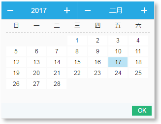
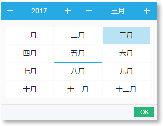

## 使用方式
在元素上添加date-pick属性
例如：`<button date-pick>年月日</button>`

### 示例

## 设置日期格式		
1. `<button date-pick data-format="yyyy-MM-dd">年月日</button>`
2. `<button date-pick data-format="yyyy-MM">年月</button>`
3. `<button date-pick data-format="yyyy/MM/dd">年月日</button>`
4. `<button date-pick data-format="yyyy/MM/dd" data-option="d">年月日， 日可选</button>`

### 如果页面没有引入 datepick.css , 脚本会自动引入该css

### 由于本插件依赖jq， 如果使用者没有引入jq， 脚本里面也会自动引入jq文件